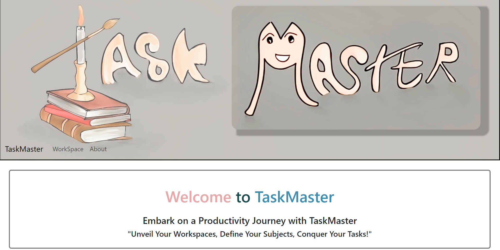
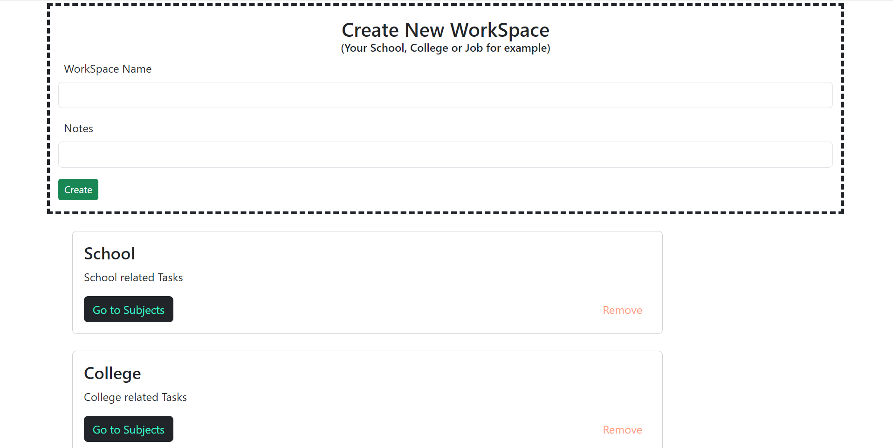
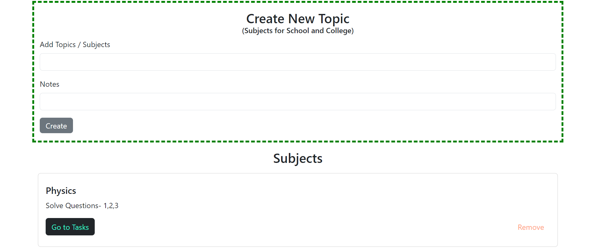
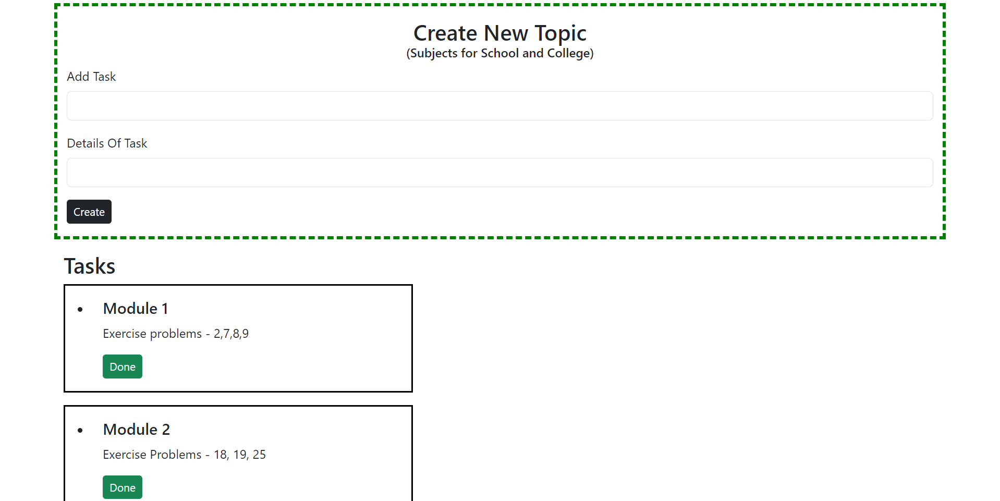

# Welcome to the Version 1.1 of TaskMaster


## TaskMaster by Team Decay of Angels


TaskMaster is a visually stunning task management web application developed by Team Decay of Angels. With an elegant and user-friendly interface crafted using CSS, TaskMaster brings you a delightful task management experience. Powered by the Dexie.js library for efficient frontend database management, this tool is tailored to help individuals, professionals, and teams streamline their task organization and boost productivity.


  
## Features


- **Exquisite UI Design:**  Immerse yourself in TaskMaster's simple and intuitive user interface, meticulously designed for a seamless experience.

  

- **User-friendly Interface:** TaskMaster boasts a user-friendly interface, ensuring ease of use and a short learning curve.

  

- **Effortless Task Management:** Create and delete tasks effortlessly and also define task titles and descriptions for each task.

  

- **Responsive Across Devices:** Experience the elegance of TaskMaster's design on any device, thanks to its responsive layout.

  

- **Persistent Data Storage:** Utilizing Dexie.js, TaskMaster ensures your task data is consistently stored using IndexedDB, assuring data integrity and availability.

  

- **Create Workspaces:** Navigate to the "Create Workspace" tab to generate a new workspace. Define its details and attributes.

  

- **Manage Subjects and Nodes:** Within each workspace, access subjects or topics to add more subjects or nodes for comprehensive organization.

  

- **Delete Workspaces and Subjects:** Maintain workspace cleanliness by removing unnecessary workspaces or subjects.

## TaskMaster by Decay Of Angels



## Installation

  
Navigate to the project directory:

  

```bash

  cd taskmaster

  npm install

```

## Usage/Examples


1. Start the development server:

```bash

  npm start

```

2. Open your preferred web browser and go to http://localhost:3000 to access TaskMaster.

3. Utilize the intuitive interface to manage tasks, create new ones, prioritize, and make updates.

## FAQ

#### How do I create a new workspace?

 In the "Workspace" tab, you can enter details for a new workspace.

  

#### Can I add multiple subjects within a workspace?

Yes, once you've created a workspace, you will be greeted at the subjects section and there you can add as many subjects or topics as you need.

  

#### Then what is the Tasks Section?

The Tasks Section is your actual Todo List where you will store all the topic details. The 3 layered structure of TaskMaster provides you an efficient way of organizing your to do components.

  

#### How can I delete a workspace or subject?

 In the workspace or subject settings, you'll find options to delete them as needed.


## Future Plans

We will be adding the Attendance Feature in the Topics/Subjects Section in Version 1.2 and then in Version 1.3, we will be adding many different features like Priority Managing for Tasks.

Likewise we will keep adding small features and changes in the following versions along with some minor updates to the UI in Versions 1.4, 1.5 and 1.6 

After Version 1.6, comes Version 2.0 which will be the Super Saiyan Transformation of TaskMaster.

There we will be implementing the User Authentication System and also another cool feature - A cloud based files uploading system in the Tasks section which will make the life of Students a lot easier as they will be able to keep all their important documents safe in one place,

So join us in our journey and keep supporting our endeavors!

## Contributing


Fork the TaskMaster repository on GitHub.

Clone your forked repository to your local machine.

Create a new branch for your feature or bug fix:

  
```bash

git checkout -b feature/my-new-feature

```

Commit your changes and push them to your forked repository.

Open a Pull Request, providing comprehensive insights into your changes and their positive impact.

  

## License

This project is licensed under the MIT License, embracing collaboration and open-source contributions.


## Acknowledgements

 We would like to extend our heartfelt gratitude to the individuals and resources that have contributed to the creation and success of TaskMaster by Team Decay of Angels. Your support, inspiration, and dedication have played a significant role in shaping this project.


## Contributors

  
- Sammya Bhattacharya #LeadDeveloper

- Partha Basak #DesignLead

- Ankush Panda

- Soumalya Mukherjee 

  

## Libraries and Tools

  
Our project would not have been possible without the incredible libraries and tools that power it:

  

- React - For building the frontend interface of TaskMaster.

- Dexie.js - For seamless database management within the application.

  
With deep appreciation,
#### Team Decay Of Angels
